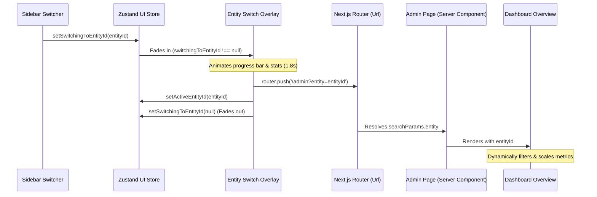

# Sunland CRM — Entity Switcher & Layout Architecture Guide

This document registers the completed layout overhauls, typography fixes, and the entity switcher state synchronization flow implemented in June 2026.

## Completed Architecture Overview

We have integrated a centralized workspace context system that aligns the sidebar switcher, the header indicators, and the main dashboard views.

## Implemented System Components

### 1. Centralized State Store
- **File**: [ui.ts](file:///c:/Users/user/OneDrive/Documents/Sunland/sunland-crm/src/store/ui.ts)
- **State Added**:
  - `activeEntityId`: Keeps track of the currently selected division context (`"group"`, `"commercial"`, `"residential"`).
  - `switchingToEntityId`: Triggers the fullscreen transition overlay and targets the loading stats.
  - Setters: `setActiveEntityId` and `setSwitchingToEntityId`.

### 2. Full-Screen Context Switching Overlay
- **File**: [entity-switch-overlay.tsx](file:///c:/Users/user/OneDrive/Documents/Sunland/sunland-crm/src/components/layout/entity-switch-overlay.tsx)
- **Features**:
  - Fades in a blurred backdrop (`backdrop-blur-xl bg-[#070919]/90`) blocking UI clicks.
  - Previews division statistics (Properties count, contact load, and revenue target) retrieved from the shared entity registry.
  - Runs a loading progress bar with descriptive status updates (e.g. "Fetching consolidated ledger...").
  - Automatically redirects URL queries using Next.js routing on completion to trigger server-side re-validation.
  - Wrapped in a React `<Suspense>` boundary to maintain static page generation compatibility for other app routes.

### 3. Navigation Header (Top Nav) Context
- **File**: [top-nav.tsx](file:///c:/Users/user/OneDrive/Documents/Sunland/sunland-crm/src/components/layout/top-nav.tsx)
- **Features**:
  - Renders a live `EntityBadge` next to the breadcrumbs displaying the active division name.
  - Features a pulsing green indicator light signifying that database context is active and synchronized.

### 4. Command Sidebar Refinements
- **File**: [sunland-nav.tsx](file:///c:/Users/user/OneDrive/Documents/Sunland/sunland-crm/src/components/layout/sunland-nav.tsx)
- **Features**:
  - Integrates the global `useUIStore` state hook.
  - Adds a horizontal separator divider (`bg-white/[0.05]`) above the switcher to distinguish it from the logo area.
  - Upgrades the collapse chevron toggle to use a high-contrast yellow background (`bg-[var(--primary)] text-[var(--on-primary)]`) so it pops visually against the dark sidebar.
  - Resolves avatar component type errors by utilizing `"rounded-lg"` shapes.

### 5. Revamped Dashboard Overview (Command Center)
- **File**: [dashboard-overview.tsx](file:///c:/Users/user/OneDrive/Documents/Sunland/sunland-crm/src/components/sunland/dashboard-overview.tsx)
- **Features**:
  - Implements the grid layout matched to the design mockup: left column double-stacked metrics, center double-width featured property, right-middle double-stacked metrics, and right column radial target progress.
  - **Dynamic Scaling & Data Adaptation**: A query-aware data filter `getAdaptedDashboard` intercepts the mock database payload, dynamically adjusting expected rent collection, lead visits, and pipeline values, and filtering lists of opportunities, lease expiries, property listings, and maintenance tickets depending on the selected division context.
  - **Client-Side Dynamic Charts**: Imports Recharts-based [sales-chart.tsx](file:///c:/Users/user/OneDrive/Documents/Sunland/sunland-crm/src/components/sunland/sales-chart.tsx) with Next.js dynamic routing (`ssr: false`) to render robust, error-free interactive bar charts on the light-themed workspace surface.
  - **SVG Radial Progress Arc**: Created [radial-progress.tsx](file:///c:/Users/user/OneDrive/Documents/Sunland/sunland-crm/src/components/sunland/radial-progress.tsx) drawing responsive vector circular gauges that track target completion per active context.
  - **Thumbnail Active Table**: Integrates property list cards directly inside the active list table including miniature building photo avatars, status badges, and localized ROI rates.

